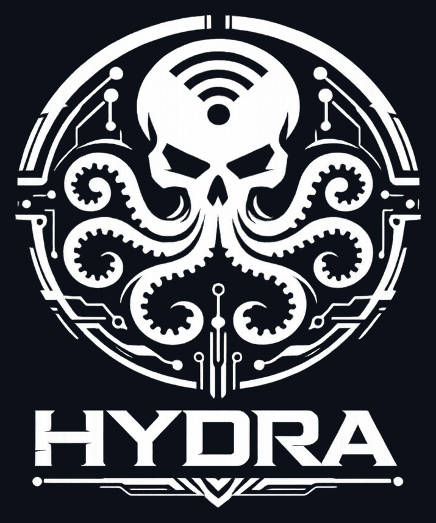

<p align="center">
  
</p>

<h1 align="center">Hydra</h1>

<p align="center">
  Firmware for the
  <a href="https://github.com/cifertech/ESP32-DIV">ESP32-DIV v1</a>
  handheld.<br>
  Forked from cifertech ESP32-DIV v1.1.0 and extended with additional features.
</p>

---

- **Target:** ESP32-WROOM-32 (plain ESP32, NOT S3)
- **Board:** ESP32-DIV v1 (main board + shield)
- **Display:** ILI9341 240×320 SPI TFT
- **Touch:** XPT2046 resistive
- **Buttons:** 5 × tactile via PCF8574 I²C expander (0x20)
- **Radios on board:** 3 × NRF24L01+, 1 × CC1101 (sub-GHz), ESP32's own WiFi/BT

## Build

Requires `arduino-cli` and ESP32 Arduino core 2.0.17 (later cores have not been
tested; the project uses Bodmer's `TFT_eSPI` via a bundled `User_Setup.h`).

```sh
arduino-cli compile \
  --fqbn "esp32:esp32:esp32:PartitionScheme=huge_app,FlashSize=4M,CPUFreq=240,FlashFreq=80,FlashMode=qio" \
  --build-property "compiler.c.elf.extra_flags=-Wl,-zmuldefs" \
  .
```

Flash:

```sh
arduino-cli upload \
  --fqbn esp32:esp32:esp32:PartitionScheme=huge_app \
  --port /dev/cu.usbserial-0001 \
  .
```

The `-Wl,-zmuldefs` is needed because TFT_eSPI ships some symbols that the
core's stock Bluetooth stack also defines; without it the link fails on
multiple-definition errors.

## Pin map (ESP32-DIV v1)

| Subsystem | Bus / signal | GPIO |
|---|---|---|
| TFT (ILI9341) | HSPI native — MISO/MOSI/SCLK/CS | 12 / 13 / 14 / 15 |
| TFT | DC, RST, backlight | 2, 0, 4 |
| Touch (XPT2046) | HSPI via matrix — CLK/MISO/MOSI/CS | 25 / 35 / 32 / 33 |
| Touch | IRQ (PENIRQ) | 34 |
| SD card | VSPI native — SCK/MISO/MOSI/CS | 18 / 19 / 23 / 5 |
| NRF24 #1 | CE / CSN | 16 / 17 |
| NRF24 #2 | CE / CSN | 26 / 27 |
| NRF24 #3 | CE / CSN | 4 / 5 |
| CC1101 (sub-GHz) | SCK/MISO/MOSI/CSN/GDO0/GDO2 | 18 / 19 / 23 / 5 / 26 / 16 |
| PCF8574 (buttons) | I²C SDA / SCL | 21 / 22 |
| Battery monitor | ADC | 36 |
| GPS UART (optional, header) | RX / TX | 32 / 25 ⚠ |
| NeoPixels (WS2812) | DIN | 1 |

### Pin conflicts to remember

- **GPIO 4:** TFT backlight AND NRF24 #3 CE.
- **GPIO 5:** SD CS AND NRF24 #3 CSN AND CC1101 CSN. The CC1101 driver uses
  the standard ESP32 VSPI default (SS=5) — the firmware never calls
  `setSpiPin()` to override it. So CC1101 and SD share the same CS line,
  and the order of `SD.begin(5)` vs `ELECHOUSE_cc1101.Init()` matters in
  every SubGHz feature that also touches the SD card.
- **GPIO 16:** NRF24 #1 CE AND CC1101 GDO2.
- **GPIO 26:** NRF24 #2 CE AND CC1101 GDO0.
- **GPIO 27:** NRF24 #2 CSN. (Not CC1101 CSN — older docs claimed this; the
  schematic and the working ELECHOUSE library defaults disagree.)
- **GPIO 25 / 32:** GPS UART2 AND touchscreen CLK/MOSI. See "GPS kills touch"
  below.

## Adding a GPS — ATGM336H (WIP)

The PCB has no GPS receiver on board, but the shield's expansion header
(J3, TSM-110-04-S-DV) breaks out enough free pins to bolt one on. The
ATGM336H is cheap, ubiquitous, runs from 3.3 V, and speaks NMEA over UART
at 9600 8N1 by default — which is what Hydra's `gps.cpp` expects.

> ⚠ **Status: Work In Progress.** The firmware-side support is in
> (`gps.cpp`, `gps_status.cpp`, GPS-tagged wardrive features), but the
> author has not yet physically soldered an ATGM336H module to their board.
> Wiring below is based on the schematic and the firmware's pin map; please
> verify with a meter on first power-up and open an issue with corrections
> if anything is off.

### Bill of materials

- 1 × ATGM336H GPS module (typically sold on a breakout PCB with an SMA or
  IPEX antenna pad — both work). The version with the active patch antenna
  on the board itself is the easiest.
- A few cm of wire, or four 2.54 mm female jumpers if you want it removable.

### Wiring

| ATGM336H pin | ESP32-DIV signal | ESP32 GPIO |
|---|---|---|
| VCC | 3.3 V on the shield's expansion header | — |
| GND | GND on the shield's expansion header | — |
| TX (module → ESP32) | `HYDRA_GPS_UART_RX` (see `gps.h`) | **GPIO 32** |
| RX (ESP32 → module) | `HYDRA_GPS_UART_TX` (see `gps.h`) | **GPIO 25** |

Power the module from 3V3, NOT 5V — the ATGM336H IC itself is a 3V3 part,
and the ESP32 GPIOs are also 3V3. Wiring it to the shield's 5V rail will
work the GPS chip's regulator hard and may level-shift TX above the ESP32's
input tolerance.

### ⚠ Pin conflict — GPS kills touch until reboot

GPIO 25 and 32 are also the XPT2046 touchscreen's CLK and MOSI lines. When
any feature calls `Gps::begin()`, ESP32 reassigns those two pins to UART2
via the GPIO matrix, and the touchscreen stops responding until a power
cycle. This is true regardless of whether a GPS module is physically
soldered — the firmware pin reassignment is what causes it.

In practice:

- **Boot:** Hydra does NOT call `Gps::begin()` at boot, so touch works
  immediately after power-on.
- **GPS-using features** (`GPS Status`, `NRF Wardrive`, `Sub-GHz Wardrive`)
  call `Gps::begin()` on entry. Touch dies for the rest of the session;
  navigate them with the physical buttons.
- **Recovery:** reboot the device. There is no software way to release the
  UART2 pin reservation that I've found that doesn't itself disturb other
  peripherals.

A future hardware revision could route GPS to a different UART on
non-touch-conflicting pins — but on v1 boards, this is the trade you make.

### Verifying after install

After soldering and flashing, open Tools → GPS Status. With a clear sky
view (or antenna at a window) you should see:

- "Sats: N" climb to a non-zero number within ~30 s of cold-start
- Time/date update once N ≥ 4 satellites
- Lat/Lon populate once you have a fix

If "Sats" stays at 0 forever:

- Confirm TX/RX aren't swapped (this is by far the most common mistake;
  the labels on cheap modules vary)
- Check VCC at the module pin with a meter (should be 3.30–3.33 V)
- Some ATGM336H clones boot at 38400 baud; if so, edit `HYDRA_GPS_BAUD` in
  `gps.h` to 38400 and reflash

## Gotchas (battle-tested 2026-05)

1. **PCF8574 init order.** Call `pcf.pinMode()` for every button pin BEFORE
   `pcf.begin()`. The library's `byteBuffered` cache is initialised inside an
   `if (writeMode>0 || readMode>0)` block; with begin-first, it stays at 0,
   making every pull-up pin read LOW on its first `digitalRead`. Symptom:
   serial log at boot shows all 5 buttons "Pressed" and the menu auto-selects
   itself. See `Hydra.ino` setup() comment.

2. **Touch on HSPI, not VSPI.** `Touchscreen.cpp` creates
   `SPIClass(HSPI)` and routes pins 25/35/32/33 via the GPIO matrix. TFT_eSPI
   uses HSPI's native pins via IO_MUX direct routing, so the two coexist on
   the same peripheral. If you ever move touch back to VSPI, every
   `SD.begin(5)` call will steal VSPI's MISO away from the touchscreen for
   the rest of the session.

3. **`Gps::begin()` kills touch.** GPS UART2 is configured on GPIO 25/32 —
   the touchscreen's CLK and MOSI. Calling `Gps::begin()` reassigns those
   pins to UART2 via the GPIO matrix and the touchscreen stops working until
   reboot. **Do NOT call `Gps::begin()` at boot.** GPS-using features
   (wardrives, gps_status) accept this trade-off and call it on entry.

4. **No SD probe in the status bar.** `utils.cpp::drawStatusBar()` does NOT
   call `isSDCardAvailable()`; the status bar SD indicator is hardcoded to
   "absent". The cifertech upstream did probe SD on every status update,
   which works on v1 but causes intermittent CC1101 corruption on cards with
   slower CMD response. Individual SD features mount the card themselves on
   entry — that's the only place SD.begin() should appear at runtime.

5. **`SD.begin(5)` after a feature exit doesn't always re-mount cleanly.**
   The Arduino ESP32 SD library caches `_pdrv` and returns true on subsequent
   `begin()` calls without re-running pin setup. If you exit an SD feature
   and then enter another, the second feature usually inherits a working
   mount. If you exit an NRF24/CC1101 feature that drove GPIO 5 (NRF24 #3
   CSN) and then enter an SD feature, force `pinMode(5, OUTPUT);
   digitalWrite(5, HIGH);` before `SD.begin(5)` to give the card a clean CS
   edge (see `esppwnagotchi.cpp`).

## Sub-features

The submenu structure roughly follows cifertech upstream. Highlights of what
Hydra added over v1.1.0:

- **WiFi:** AP scan, deauth (single/multi/evil), CSA attack, SAE attack,
  probe flood, beacon spoof, hidden-SSID reveal, ESPPwnagotchi (handshake
  pcap to SD), evil-portal detect, Pineapple detect, Flipper detect,
  Rayban-Stories detect, Flock detect, AirTag detect, ESP-detect, multi-SSID
  detect, probe detect, pwn detect.
- **Bluetooth:** sniffer, jammer/spam, gotchi variants, freq detector.
- **2.4 GHz:** scanner, replay, sniffer (NRF24), mode-jammer, mousejack,
  carrier, intermittent, triwatch, heatmap, BLE-adv generator, wardrive
  (NRF24 channel logging to CSV).
- **Sub-GHz:** spectrum analyzer, replay, sweep jammer, wardrive (CC1101 +
  GPS NMEA → CSV).
- **Tools:** GPS status, SD browser, SD format, target list, freq detector,
  skimmer detect.
- **Frequency:** wardrive channel viewer.

## Thanks / credits

Hydra exists because of a long list of open-source hardware and firmware
projects. Listed roughly in order of how much of their work is in here:

- **[cifertech](https://github.com/cifertech/)** — the ESP32-DIV v1 board
  hardware (schematic, PCB, BOM) and the v1.1.0 firmware Hydra was forked
  from. Pretty much everything that draws a menu, the touch UI, the WiFi/BLE
  attack scaffolding, and the sub-GHz code lineage starts here.
- **[justcallmekoko / ESP32Marauder](https://github.com/justcallmekoko/ESP32Marauder)**
  — reference for WiFi scanning patterns, deauth, evil portal, beacon spoof,
  PMKID, EAPOL handshake capture, and a great deal more. Sets the bar for
  this class of firmware.
- **[Bruce](https://github.com/pr3y/Bruce)** — multi-tool firmware whose
  feature breadth and UX inspired several Hydra additions.
- **[RF-Clown / NRF Clown](https://github.com/somu1795/RF-Clown)** — NRF24
  jamming, BLE-adv, intermittent / sweep patterns.
- **[AppleJuice](https://github.com/ECTO-1A/AppleJuice)**,
  **[ESP32-Sour-Apple](https://github.com/RapierXbox/ESP32-Sour-Apple)** —
  Apple BLE spoofing / continuity packet techniques.
- **[ESP32-AirTag-Scanner](https://github.com/AlexLynd/ESP32-AirTag-Scanner)**
  — AirTag / FindMy detection.
- **[Momentum-Apps `ble_spam`](https://github.com/Next-Flip/Momentum-Apps)**
  — BLE spam pattern catalogue (Flipper Zero port that we cross-referenced).
- **[PwnGridSpam](https://github.com/Adamtot/Pwnagotchi-Detector)** — fake
  Pwnagotchi adverts and the basis for our pwn-detect.
- **[flock-you](https://github.com/latte-soft/flock-you)** — Flock ALPR-camera
  surveillance detection.
- **[opendroneid-core-c](https://github.com/opendroneid/opendroneid-core-c)**
  — drone Remote ID broadcast decoding.
- **[BlueJammer](https://github.com/Spooks4576/BLE_Jamming)**,
  **[SubMarine](https://github.com/lukeslp/submarine)**,
  **[Universal-RC-system](https://github.com/dronefactory/Universal-RC-system)**
  — additional jamming / RC / sub-GHz reference work.

Libraries that do the heavy lifting:

- [Bodmer/TFT_eSPI](https://github.com/Bodmer/TFT_eSPI) (bundled User_Setup
  for DIV v1)
- [xreef/PCF8574](https://github.com/xreef/PCF8574_library) (with init-order
  caveat, see Gotchas above)
- [PaulStoffregen/XPT2046_Touchscreen](https://github.com/PaulStoffregen/XPT2046_Touchscreen)
- [LSatan/SmartRC-CC1101-Driver-Lib](https://github.com/LSatan/SmartRC-CC1101-Driver-Lib)
- [nRF24/RF24](https://github.com/nRF24/RF24)
- [stevemarple/MicroNMEA](https://github.com/stevemarple/MicroNMEA)

If your project is on this device and not on this list, it's an oversight,
not a slight — please open an issue / PR and we'll add you.

## License

**Hydra is free for personal, non-commercial use only.** See
[`LICENSE`](LICENSE) for the full terms.

Files retained from the upstream cifertech ESP32-DIV v1.1.0 firmware remain
under the upstream MIT license (Copyright (c) 2023 CiferTech). Modifications
and new code added by the Hydra project are licensed under the personal-use
terms in `LICENSE`. Commercial use of the firmware as a whole requires
written permission — open a GitHub issue with the `commercial license`
label to start that conversation.
